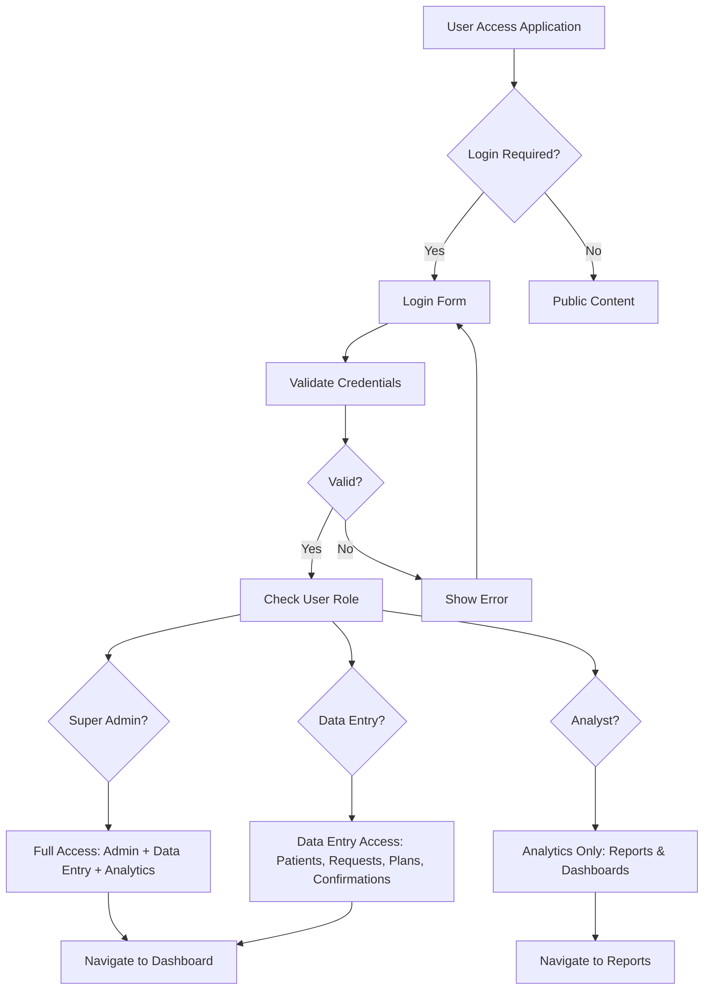
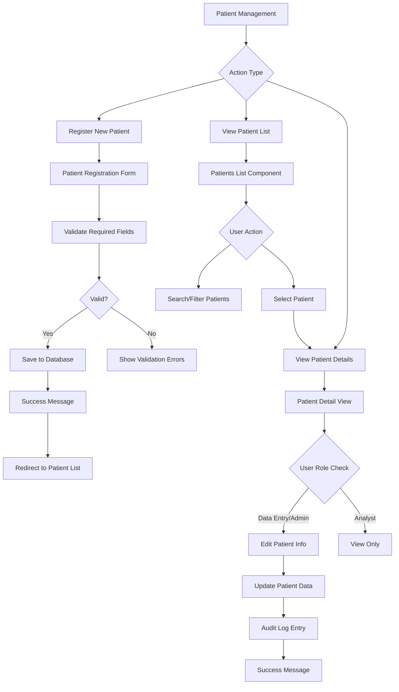
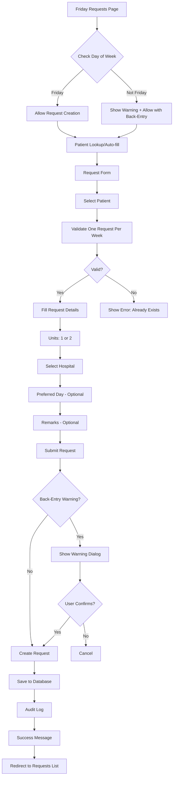
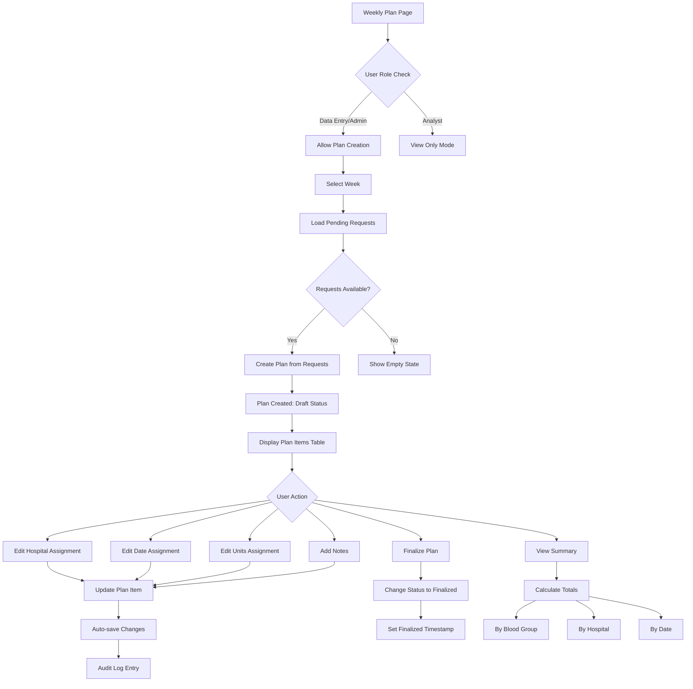
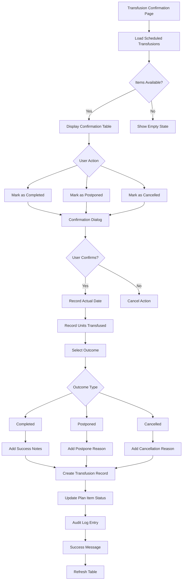
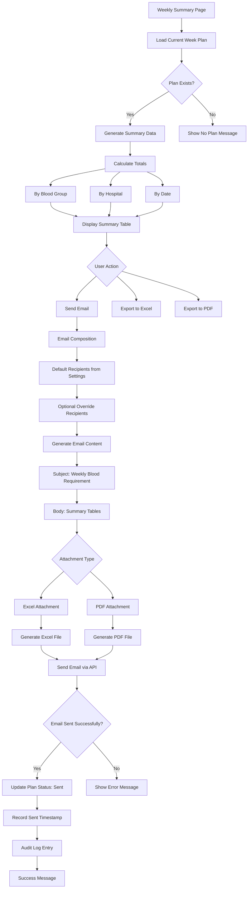
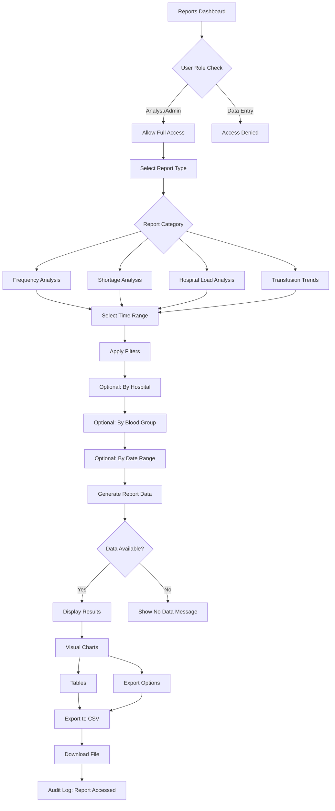
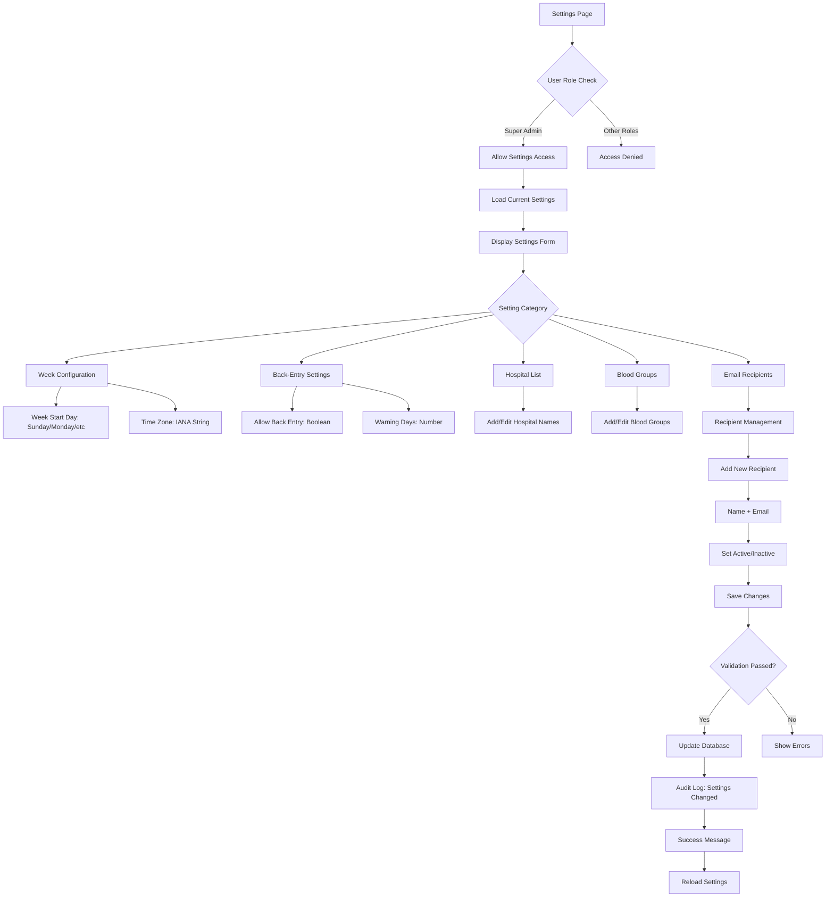
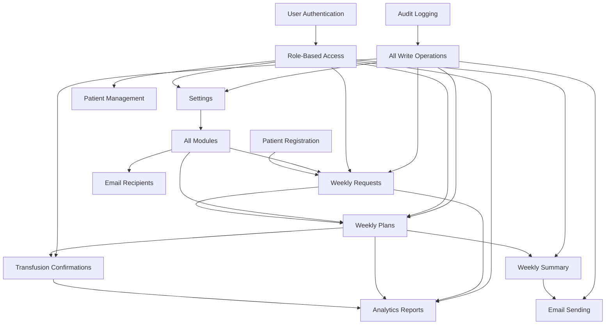

# Patient Portal Application - Visual Flow Diagrams

This document contains visual representations of all unique flows in the Blood Transfusion Planning & Tracking application.

## 1. Authentication & Authorization Flow

## 2. Patient Management Flow

## 3. Weekly Request Creation Flow (Friday Requests)

## 4. Weekly Planning Flow

## 5. Transfusion Confirmation Flow

## 6. Email & Communication Flow

## 7. Analytics & Reporting Flow

## 8. Settings Management Flow

## Summary of Key Integration Points

These diagrams represent the complete workflow of the Blood Transfusion Planning & Tracking system, showing how all components interact and the user journeys through different roles and functionalities.